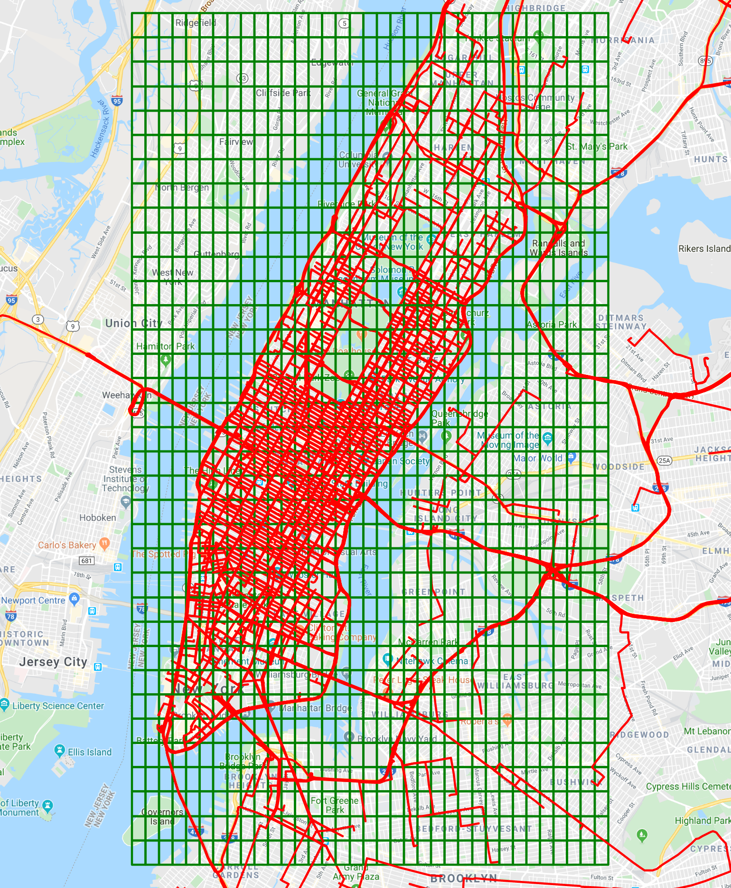

# COVID-19: Risk of Geographical Areas being infected
This experimental project was done as a use-case of my research paper (https://github.com/saimmehmood/semantic_relationships) to predict COVID-19 infection hotspots for a probable second wave of cases in Manhattan area.

## Key Points
 - We began at exploring a geographical space and looking at movement path of people i.e, trajectories.
 - We divided geographical space into uniform grid cells and discussed the trade-off between having smaller or larger grid sizes.
 - Further, we elaborated on how dividing geographical space enables us to translate trajectories from a set of geolocation coordinates into a set of grid cells.
 - Lastly, we performed various Postgres/PostGIS queries to find grid cells through which trajectories are traversing.
 - In the end, python (numpy, pandas) enable us in putting trajectories belonging to each cell together and we rank them through a bash command.
 
## Data Preparation
The dataset I’m using is released by NYC Taxi and Limousine Commission (TLC), which includes pickup & dropoff time, geo-coordinates, number of passengers, and several other features. 
- The data-set file contains 1,048,576 trip records containing pickup and dropoff points as pairs of (longitude, latitude) coordinates.  - For the needs of this experiment, I rely on random sample *S* that includes 10,000 pairs. 
- For each pair of pickup and dropoff coordinates, I utilize Google Directions API (new_york_taxi.py) to create trajectories in NYC.

## Conclusion and Furture Work
In essence, this work provides a simple, easy-to-follow **proof-of-concept** in finding areas that are at a high risk of being affected by COVID-19. As future work, I’m looking forward to designing a machine learning based model.
- That given a geographical area, given trajectories inside that area, find hotspots that are at a high risk of being affected by covid-19 or any other infectious disease.

#### Link to medium post:
https://towardsdatascience.com/covid-19-risk-of-geographical-areas-being-infected-a81938a5e286

##### Link to the gists: 
https://gist.github.com/saimmehmood

